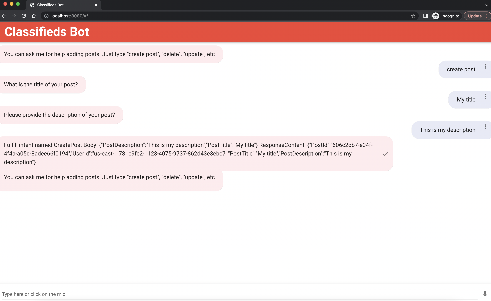

# Separation of concerns

Right now, we have our application code for Lex UI together with our Infrastructure-as-Code. While this may be ok for a small application, this may cause issues down the road. For example, you want to avoid unnecessarily triggering your Terraform pipelines because of updates to application code, etc.

## Seperate Lex UI

Remove Lex UI source code from your Infrastructure-as-Code by running the following command:

```shell
rm -rf src/aws-lex-web-ui
```

Clone the repository to use for UI in another location on your machine:

```shell
git clone git@github.com:musonza/aws-terraform-by-example-lex-ui.git
```

1. Make the following updates to add your poolId to `src/main.js`.

Obtain the poolId by running:

```shell
terraform console
resource.aws_cognito_identity_pool.main.id
```

_src/main.js_

```js
// ...
const poolId = '<YOUR_POOL_ID_HERE>' // example: 'us-east-1:738de87b-0fac-4460-bba5-47c2a3467ff6'
const region = '<REGION>' // example: us-east-1
// ...
```

2. Install dependencies `npm install`

3. Serve with hot reload at localhost:8080 `npm run dev`

Navigating to the dev URL, you will see your UI and will be able to interact with your chatbot.


