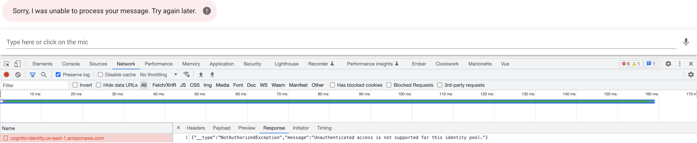
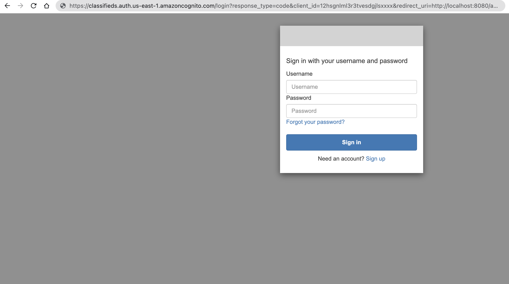

# Authentication

We have the setting `allow_unauthenticated_identities` set to `true` for Amazon Cognito identity, meaning we are allowing access to AWS resources to unauthenticated users through our identity pool.

Ideally we should only allow access to authenticated users. There are several reasons why we might want to only allow authenticated users:

**Security**

If we keep `allow_unauthenticated_identities` set to `true`, anyone can assume an identity in our identity pool and access our AWS resources. This can be a security risk, especially if the AWS resources contain sensitive information or functionality.

**Billing**

We would like to avoid unexpected charges from unauthenticated access.

**User management**

By requiring users to authenticate before accessing our AWS resources, we can better manage our user base. We can set up user authentication policies, track user activity, and revoke access if necessary. This is going to come in handy when we need to associate posts with specific users, etc.

**Integration**

Setting `allow_unauthenticated_identities` to `false` can make it easier to integrate our AWS resources with other authentication providers (Google, Facebook, etc). By requiring users to authenticate with a specific provider, we can ensure that our AWS resources are accessed only by authorized users.

:::info

Overall, many good reasons exist to set `allow_unauthenticated_identities` to `false`. First, by requiring authentication before accessing your AWS resources, you can better protect your resources, manage your users, and customize the user experience.

:::

## Disallow aunthenticated users

In your Terraform project, go to `cognito.tf` and update your `aws_cognito_identity_pool` resource by setting `allow_unauthenticated_identities` to `false` as below

```hcl{3}
resource "aws_cognito_identity_pool" "main" {
  identity_pool_name = "classifieds"
  allow_unauthenticated_identities = false
  allow_classic_flow               = false
}
```

Run `terraform apply`

After applying your changes, you will get an error if you try to interact with the chatbot.

`{"__type":"NotAuthorizedException","message":"Unauthenticated access is not supported for this identity pool."}`



We need to authenticate our users before they can interact with the chatbot. Let's take a second to think about some of the requirements to achieve this:

- A signup form for our users
- A login form for our users
- Once a user authenticates, we need to have some token that we can use to make requests to AWS

You might be thinking, this is a lot to set up in our application. Luckily, we don't have to build the user interface from scratch. Instead, we can use AWS Hosted UI.

## Hosted UI

AWS Hosted UI is an Amazon Web Services (AWS) feature that provides a pre-built user interface for authentication and user management. With AWS Hosted UI, developers can easily add authentication to their web or mobile applications using popular identity providers such as Amazon Cognito User Pools, Facebook, Google, and other OpenID Connect (OIDC) and Security Assertion Markup Language (SAML) providers. We are using Amazon Cognito User Pools for our identity provider. AWS Hosted UI provides you an OAuth 2.0 compliant authorization server.

The AWS Hosted UI allows developers to quickly integrate user authentication into their applications without building their own authentication flow or user interface. In addition, it provides users with a secure and customizable login experience, with features like multi-factor authentication, social sign-in, and customizable branding.

Developers can also use AWS Hosted UI to manage user profiles and data and handle user authentication and authorization in a scalable and reliable manner.

### Setting up the hosted UI

#### Create an app client

An **app client** is a configuration entity representing a client application that interacts with Amazon Cognito User Pools. An app client is a unique identifier that allows the client application to authenticate with the user pool, using various authentication flows such as OAuth 2.0, OpenID Connect, and SAML.

In `cognito.tf` create an app client by adding the following block:

```hcl
// ...
resource "aws_cognito_user_pool_client" "client" {
  name         = "classifieds_client"
  user_pool_id = aws_cognito_user_pool.classifieds.id
  // We can configure additional providers like Facebook, Google, etc
  supported_identity_providers = [
    "COGNITO",
  ]
  callback_urls                        = var.identity_provider_callback_urls
  allowed_oauth_flows                  = ["code"]
  allowed_oauth_flows_user_pool_client = true
  allowed_oauth_scopes = [
    "email",
    "openid",
  ]
}
// ...
```

Add the `identity_provider_callback_urls` variable to the `variables.tf` file.

```hcl
variable "identity_provider_callback_urls" {
  type        = list(any)
  description = "List of allowed callback URLs for the identity providers"
  default     = ["http://localhost:8080/auth/callback"]
}
```

#### Configure a user pool domain

Now that you have an app client, next is adding a user pool domain. The user pool domain is the address of your sign-up and sign-in web pages. You can use an Amazon Cognito hosted domain and choose an available domain prefix, or you can use your own web address as a custom domain.

Add **aws_cognito_user_pool_domain** to `cognito.tf`

```hcl
resource "aws_cognito_user_pool_domain" "main" {
  user_pool_id = aws_cognito_user_pool.classifieds.id
  domain       = var.cognito_user_pool_domain
}
```

Add your Cognito domain prefix to `variables.tf` as below. We have chosen `classifieds`, but you can add any prefix.

```hcl
variable "cognito_user_pool_domain" {
  type        = string
  description = "Cognito domain"
  default     = "classifieds"
}
```

:::info

If you choose an Amazon Cognito hosted domain, it's worth noting that Cognito domains are not unique across all of AWS but unique within a region and within an AWS account.

:::

Run `terraform apply` to create the new resources.

Verify your hosted domain by navigating to the following url

`https://<domain_prefix>.auth.<region>.amazoncognito.com/login?response_type=code&client_id=<your_app_client_id>&redirect_uri=<your_callback_url>`

You can navigate to AWS console to obtain the `client_id` or use Terraform console.

```bash
> terraform console
> resource.aws_cognito_user_pool_client.client.id
"12hsgnlml3r3tvesdgjlsxxxx"
```

Example

`https://classifieds.auth.us-east-1.amazoncognito.com/login?response_type=code&client_id=12hsgnlml3r3tvesdgjlsxxxx&redirect_uri=http://localhost:8080/auth/callback`



Instead of figuring out all the parameters for the login url let's add an output variable to `outputs.tf` as below

```hcl
output "cognito_login_url" {
  value = "https://${aws_cognito_user_pool_domain.main.domain}.auth.${var.aws_region}.amazoncognito.com/login?response_type=code&client_id=${aws_cognito_user_pool_client.client.id}&redirect_uri=${var.default_callback_url}"
}
```

Also add `default_callback_url` to `vars.tf`

```hcl
// TODO configure by environment, local, staging, production
variable "default_callback_url" {
  type        = string
  description = "The default callback URL for identity providers"
  default     = "http://localhost:8080/auth/callback"
}
```

Now when you apply your terraform changes you will get a `cognito_login_url` back.
